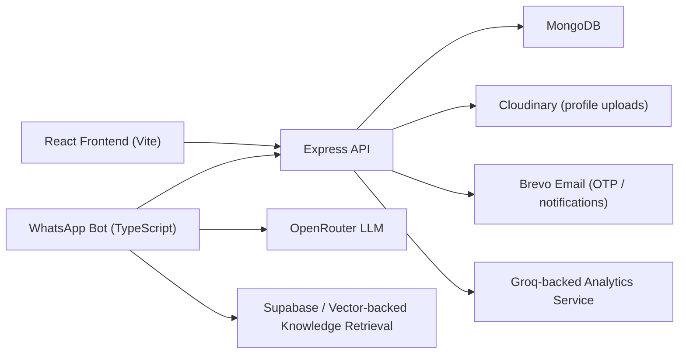

# DayFlow HRMS

DayFlow HRMS is a full-stack Human Resource Management System built for small to mid-sized organizations that need a single operational surface for employee records, attendance, leave management, task tracking, payroll generation, workforce analytics, and conversational HR automation.

This repository is intentionally more than a CRUD demo. It combines:

- A React + Vite web application for admins and employees
- An Express + MongoDB backend with role-based APIs
- A TypeScript WhatsApp bot that talks to the HRMS over secured bot endpoints
- AI-assisted workforce analytics and knowledge retrieval

The result is a project that is useful as both:

- A real internal operations platform
- A strong interview portfolio piece for frontend, backend, and full-stack engineering discussions

## Table of Contents

- [What Problem This Solves](#what-problem-this-solves)
- [Core Product Capabilities](#core-product-capabilities)
- [Architecture Overview](#architecture-overview)
- [Tech Stack](#tech-stack)
- [Repository Structure](#repository-structure)
- [Domain Model](#domain-model)
- [Key Engineering Flows](#key-engineering-flows)
- [API Overview](#api-overview)
- [Pagination Contract](#pagination-contract)
- [Local Development Setup](#local-development-setup)
- [Environment Variables](#environment-variables)
- [Available Scripts](#available-scripts)
- [Testing Strategy](#testing-strategy)
- [Security Notes](#security-notes)
- [Scalability and Performance Considerations](#scalability-and-performance-considerations)
- [Production Hardening Checklist](#production-hardening-checklist)
- [Interview Talking Points](#interview-talking-points)

## What Problem This Solves

Most HR tools in smaller organizations get fragmented quickly:

- employee data lives in one place
- leave approvals happen in chat
- attendance is tracked in sheets
- task assignment sits in a separate app
- payroll becomes a monthly manual reconciliation exercise

DayFlow HRMS consolidates those workflows into one system and adds automation on top:

- attendance can be validated against approved office networks
- leave decisions can trigger notification delivery workflows
- payroll can be computed from attendance and approved leave
- leadership analytics can be cached and recomputed in batches
- employees can interact with the system through WhatsApp, not just the web UI

## Core Product Capabilities

### Admin capabilities

- Manage departments
- Create employees with generated credentials and salary structure support
- View employee directory with paginated APIs
- Review, approve, or reject leave requests
- Assign tasks to employees
- Generate monthly payroll
- Manage approved office/public IP networks for attendance verification
- Review flagged attendance check-ins
- Access workforce analytics and burnout-risk style insights

### Employee capabilities

- Login with password or email OTP
- Check in and check out for daily attendance
- View attendance history and yearly calendar
- Apply for leave and track leave history
- View and update assigned tasks
- Update profile and change password
- View payroll records

### Conversational bot capabilities

- Verify employees by phone number
- Apply leave from WhatsApp
- Check in and check out from chat
- Read task assignments
- Mark tasks complete
- Claim and acknowledge leave notifications
- Answer HR questions using a knowledge-base retrieval pipeline

## Architecture Overview



### Runtime shape

- `frontend/` serves the admin and employee dashboards
- `server/` owns core business logic, data integrity, auth, payroll, attendance, leave, and analytics
- `HRMS-bot/` is an independent runtime that integrates with WhatsApp and calls protected bot endpoints on the server

### Why this architecture is useful

- The web app and bot are decoupled but share the same source of truth
- Business rules remain server-side, not duplicated across clients
- The bot can evolve independently without changing the primary app shell
- Operational modules like payroll and analytics are separated from request/response UI concerns

## Tech Stack

### Frontend

- React 19
- React Router 7
- Vite
- Tailwind CSS 4
- Axios
- Framer Motion
- Lucide + Phosphor icons

### Backend

- Node.js
- Express 5
- MongoDB + Mongoose
- JWT authentication
- Multer + Cloudinary for media upload
- Brevo for email delivery

### Automation and AI

- Groq-backed analytics insight generation
- OpenRouter for bot LLM access
- Supabase for bot-side retrieval and embeddings storage
- Baileys for WhatsApp connectivity

### Testing

- Vitest
- Supertest
- Testing Library
- MongoDB Memory Server

## Repository Structure

```text
.
├── frontend/                 # React application
│   ├── src/components/       # Admin, employee, payroll, analytics, tasks
│   ├── src/pages/            # Route-level pages
│   ├── src/context/          # Auth context
│   └── tests/                # Frontend tests
├── server/                   # Express API
│   ├── controller/           # Route handlers
│   ├── services/             # Attendance, leave, analytics, notification logic
│   ├── models/               # Mongoose schemas
│   ├── routes/               # HTTP route definitions
│   ├── middleware/           # Auth, admin, file upload, bot secret, client IP
│   └── tests/                # Integration and unit tests
├── HRMS-bot/                 # WhatsApp bot runtime
│   ├── src/modules/          # Conversation, attendance, leave, tasks, RAG
│   ├── scripts/              # Ingestion utilities
│   └── src/tests/            # Bot tests
└── performance-tests/        # Load/perf experiments
```

## Domain Model

The core entities in the system are designed around real HR operations rather than demo-only objects.

| Entity | Purpose |
| --- | --- |
| `User` | Auth identity plus HR fields like role, department, employee ID, phone number, salary structure |
| `Department` | Organizational grouping used by admins |
| `Attendance` | Daily attendance record with check-in/out, work hours, arrival status, IP verification state, and flags |
| `Leave` | Employee leave request with approval status, comments, and notification delivery metadata |
| `Task` | Admin-assigned work items with assignee, assigner, priority, due date, and status |
| `Payroll` | Generated monthly payroll snapshot including attendance summary and salary breakdown |
| `CompanyNetwork` | Whitelisted public IPs used to validate attendance check-ins |
| `AnalyticsInsight` | Cached performance and risk insights for a sliding time window |

### Notable model decisions

- `Attendance` is unique by `employee + date`, preventing duplicate records
- `Payroll` is unique by `employee + month`, making payroll generation idempotent
- `CompanyNetwork.publicIP` is unique, which protects the whitelist from duplicate entries
- `AnalyticsInsight` uses TTL cleanup through `expiresAt`, so stale AI-generated insights expire automatically

## Key Engineering Flows

### 1. Attendance with network verification

When an employee checks in:

1. the server resolves the client IP
2. the IP is checked against approved office networks
3. the check-in is still allowed even if the IP is unapproved
4. the record is marked as flagged for HR review when necessary

This is a strong real-world tradeoff:

- it does not block legitimate work because of network instability
- it still preserves compliance and reviewability

### 2. Automated absent marking

The server starts an attendance automation cycle on boot. On a configured schedule, it:

- looks at the previous day
- skips non-working days when configured
- finds employees without attendance records
- excludes employees on approved leave
- inserts absent attendance entries for the rest

This turns attendance into a complete ledger rather than a partial log.

### 3. Leave approval with delivery tracking

Leave updates are not just status flips. The system also tracks:

- pending notification states
- last attempted delivery
- last delivered status
- last notification failure

This makes the workflow more resilient for integrations like WhatsApp delivery or async notification workers.

### 4. Payroll generation

Payroll generation works monthly and uses:

- employee salary structure
- approved leave overlap
- attendance records in the selected month
- per-day salary math

Payroll is upserted, so rerunning generation for the same month updates rather than duplicates records.

### 5. Cached workforce analytics

Analytics are computed over sliding windows, not one-off snapshots.

The system combines:

- attendance rate
- task completion rate
- task velocity
- leave patterns

It stores:

- performance score
- risk score
- risk level
- insight summary
- recommendations

This is useful for manager dashboards and also a good discussion point for AI-assisted product design.

### 6. Bot-driven HR workflows

The WhatsApp bot integrates through secret-protected server endpoints and supports:

- employee verification by phone number
- leave applications
- task retrieval and completion
- attendance operations
- leave notification claims and acknowledgements

This is a practical example of designing a system where a conversational interface is a first-class client, not an afterthought.

## API Overview

The server organizes APIs by domain. The list below is not exhaustive, but it covers the major interfaces you will use during development.

### Authentication

| Method | Route | Description |
| --- | --- | --- |
| `POST` | `/api/auth/login` | Password login |
| `POST` | `/api/auth/login/send-otp` | Send OTP email for login |
| `POST` | `/api/auth/login/verify-otp` | Verify OTP and issue JWT |
| `GET` | `/api/auth/verify` | Validate token and return current user |

### Employees and departments

| Method | Route | Description |
| --- | --- | --- |
| `GET` | `/api/employee/get` | Paginated employee directory |
| `POST` | `/api/employee/add` | Create employee with generated password |
| `DELETE` | `/api/employee/:id` | Delete employee |
| `PUT` | `/api/employee/:id/salary` | Update employee salary structure |
| `GET` | `/api/department` | List departments |
| `POST` | `/api/department/add` | Create department |
| `PUT` | `/api/department/:id` | Update department |
| `DELETE` | `/api/department/:id` | Delete department |

### Attendance

| Method | Route | Description |
| --- | --- | --- |
| `POST` | `/api/attendance/check-in` | Employee check-in |
| `POST` | `/api/attendance/check-out` | Employee check-out |
| `GET` | `/api/attendance/today` | Today's attendance status |
| `GET` | `/api/attendance/logs` | Paginated attendance history for employee |
| `GET` | `/api/attendance/year` | Yearly attendance data |
| `GET` | `/api/attendance/network-status` | Validate current network |
| `GET` | `/api/attendance/flagged` | Paginated flagged attendance records for admins |

### Leave management

| Method | Route | Description |
| --- | --- | --- |
| `POST` | `/api/leave/apply` | Create leave request |
| `GET` | `/api/leave/showLeave` | Paginated leave history for employee |
| `GET` | `/api/leave/leave-requests` | Paginated leave review queue for admins |
| `PUT` | `/api/leave/update-status/:id` | Approve or reject leave |
| `GET` | `/api/leave/my-leaves` | Pending leave count for employee dashboard |

### Tasks

| Method | Route | Description |
| --- | --- | --- |
| `POST` | `/api/task` | Create task |
| `GET` | `/api/task/all` | Paginated task list for admins |
| `GET` | `/api/task/my-tasks` | Paginated task list for employee |
| `PUT` | `/api/task/:id/status` | Update task status |
| `DELETE` | `/api/task/:id` | Delete task |

### Payroll

| Method | Route | Description |
| --- | --- | --- |
| `POST` | `/api/payroll/generate` | Generate monthly payroll |
| `GET` | `/api/payroll` | Fetch payrolls for admins |
| `GET` | `/api/payroll/me` | Fetch payrolls for current employee |
| `GET` | `/api/payroll/:id` | Fetch a payroll by ID |
| `PUT` | `/api/payroll/structure/:employeeId` | Update salary structure |

### Admin network controls

| Method | Route | Description |
| --- | --- | --- |
| `GET` | `/api/company-network` | List approved public IPs |
| `POST` | `/api/company-network` | Create approved network |
| `POST` | `/api/company-network/add-current` | Add current public IP |
| `PUT` | `/api/company-network/:id` | Update whitelist entry |
| `DELETE` | `/api/company-network/:id` | Delete whitelist entry |

### Analytics

| Method | Route | Description |
| --- | --- | --- |
| `GET` | `/api/analytics` | Workforce insight list |
| `GET` | `/api/analytics/employee/:employeeId` | Employee insight detail |
| `POST` | `/api/analytics/recompute` | Trigger analytics recompute |

### Bot-only endpoints

These routes are protected using `x-bot-secret-key` through `botSecretMiddleware`.

| Method | Route | Description |
| --- | --- | --- |
| `POST` | `/api/bot/verify-employee` | Verify employee from bot |
| `POST` | `/api/bot/leaves/apply` | Apply leave from bot |
| `POST` | `/api/bot/attendance/check-in` | Check in from bot |
| `POST` | `/api/bot/attendance/check-out` | Check out from bot |
| `GET` | `/api/bot/tasks` | Fetch assigned tasks |
| `PATCH` | `/api/bot/tasks/:taskId/complete` | Mark task complete |
| `POST` | `/api/bot/leave-notifications/claim` | Claim pending leave notifications |

## Pagination Contract

Core list endpoints support query-parameter pagination:

```http
GET /api/resource?page=1&limit=10
```

The paginated response shape is:

```json
{
  "success": true,
  "currentPage": 1,
  "totalPages": 5,
  "totalItems": 42,
  "limit": 10
}
```

This contract is currently implemented on:

- employees
- leave history
- leave approval queue
- admin tasks
- employee tasks
- attendance logs
- flagged attendance records

This is important because it keeps the API ready for larger datasets and prevents the frontend from assuming full-collection reads forever.

## Local Development Setup

### Prerequisites

- Node.js 20+
- npm 10+
- MongoDB instance
- Brevo account for OTP email delivery
- Cloudinary account for profile uploads
- Groq API key for analytics generation
- OpenRouter + Supabase for the WhatsApp bot

### 1. Clone the repo

```bash
git clone <your-repo-url>
cd dayflow
```

### 2. Install dependencies

This repository is organized as multiple deployable apps, so install each package separately.

```bash
cd frontend && npm install
cd ../server && npm install
cd ../HRMS-bot && npm install
```

### 3. Configure environment variables

Create `.env` files for:

- `server/.env`
- `HRMS-bot/.env`
- optionally `frontend/.env`

Use the [Environment Variables](#environment-variables) section below.

### 4. Start the backend

```bash
cd server
npm run dev
```

The Express API runs on `http://localhost:5001` by default.

### 5. Start the frontend

```bash
cd frontend
npm run dev
```

The React app runs on Vite, usually `http://localhost:5173`.

### 6. Start the bot

```bash
cd HRMS-bot
npm run dev
```

The bot exposes a health endpoint and then connects to WhatsApp through Baileys.

### 7. Optional: seed data

The repository includes seed and helper scripts in:

- `server/db/seed.js`
- `server/userSeed.js`
- `server/seed_dev_d.js`

Review them before running in any shared environment.

## Environment Variables

### Backend: `server/.env`

| Variable | Required | Purpose |
| --- | --- | --- |
| `PORT` | No | API port, defaults to `5001` |
| `MONGODB_URL` | Yes | MongoDB connection string |
| `JWT_KEY` | Yes | JWT signing secret |
| `CORS_ORIGINS` | No | Extra comma-separated allowed origins |
| `BREVO_API_KEY` | For OTP/email | Email delivery key |
| `SENDER_EMAIL` | For OTP/email | Sender address |
| `CLOUDINARY_CLOUD_NAME` | For profile uploads | Cloudinary config |
| `CLOUDINARY_API_KEY` | For profile uploads | Cloudinary config |
| `CLOUDINARY_API_SECRET` | For profile uploads | Cloudinary config |
| `CLOUDINARY_FOLDER` | No | Upload folder, defaults to `dayflow_profiles` |
| `BOT_SECRET_KEY` or `HRMS_BOT_SECRET_KEY` | For bot integration | Protects `/api/bot/*` |
| `GROQ_API_KEY` | For analytics insights | Groq model access |
| `ATTENDANCE_AUTOMATION_ENABLED` | No | Enable or disable absent backfill |
| `ATTENDANCE_AUTOMATION_TZ` | No | Attendance automation timezone |
| `ATTENDANCE_AUTOMATION_RUN_AT` | No | Daily run time, default `00:30` |
| `ATTENDANCE_AUTOMATION_CHECK_INTERVAL_MS` | No | Scheduler loop interval |
| `ATTENDANCE_LATE_AFTER_HOUR` | No | Attendance lateness threshold hour |
| `ATTENDANCE_LATE_AFTER_MINUTE` | No | Attendance lateness threshold minute |
| `LEAVE_NOTIFICATION_RETRY_DELAY_MS` | No | Retry delay for leave notification delivery |
| `ANALYTICS_WINDOW_DAYS` | No | Sliding insight window |
| `ANALYTICS_BASELINE_DAYS` | No | Baseline comparison window |
| `ANALYTICS_AI_BATCH_SIZE` | No | Analytics batch size |
| `ANALYTICS_CACHE_TTL_DAYS` | No | TTL for cached analytics insights |

### Frontend: `frontend/.env`

| Variable | Required | Purpose |
| --- | --- | --- |
| `VITE_API_URL` | No | Overrides backend base URL; defaults to `http://localhost:5001` |

### Bot: `HRMS-bot/.env`

| Variable | Required | Purpose |
| --- | --- | --- |
| `OPENROUTER_API_KEY` | Yes | LLM access for the bot |
| `OPENROUTER_BASE_URL` | No | Defaults to OpenRouter public API |
| `LLM_MODEL` | No | Bot chat model |
| `EMBEDDING_MODEL` | No | Embedding model for retrieval |
| `SUPABASE_URL` | Yes | Retrieval/index backend |
| `SUPABASE_SERVICE_ROLE_KEY` | Yes | Supabase service credentials |
| `BOT_NAME` | No | Health/readability config |
| `SHOP_NAME` | No | Prompt context |
| `MAX_HISTORY_TURNS` | No | Conversation memory depth |
| `TOP_K_CHUNKS` | No | Retrieval fan-out |
| `SIMILARITY_THRESHOLD` | No | Retrieval filter |
| `PORT` | No | Bot health server port |
| `HRMS_API_BASE_URL` | Yes | Base URL for the Express HRMS API |
| `HRMS_BOT_SECRET_KEY` or `BOT_SECRET_KEY` | Yes | Secret header for bot-server auth |
| `HRMS_API_TIMEOUT_MS` | No | Timeout for API calls from bot |
| `EMPLOYEE_VERIFY_CACHE_TTL_MS` | No | Employee verification cache TTL |
| `LEAVE_NOTIFICATION_POLL_INTERVAL_MS` | No | Poll interval for leave notifications |

## Available Scripts

### Frontend

```bash
cd frontend
npm run dev
npm run build
npm run lint
npm run test
```

### Backend

```bash
cd server
npm run dev
npm run start
npm run test
```

### Bot

```bash
cd HRMS-bot
npm run dev
npm run build
npm run start
npm run ingest
npm run test
```

## Testing Strategy

This repo includes meaningful tests rather than only smoke checks.

### Backend

- integration tests for attendance flows
- integration tests for leave notification queue behavior
- auth and bot interaction tests
- unit tests for helpers and middleware

### Frontend

- login flow coverage with mocked network responses
- component-level tests for dashboard widgets

### Bot

- attendance intent and end-to-end flows
- leave notification worker tests
- leave state machine tests

### Suggested local verification

Before shipping changes, run:

```bash
cd frontend && npm run build && npm run test
cd ../server && npm run test
cd ../HRMS-bot && npm run build && npm run test
```

## Security Notes

There are several good security decisions already present in the codebase:

- JWT-based session validation
- role-based route protection for admin operations
- OTP login with cooldown, TTL, and attempt limits
- reduced account enumeration risk in OTP send flow
- E.164 phone validation for employee records
- bot-only endpoints protected by a shared secret header
- IP validation for company network whitelisting

### Sensitive workflows worth calling out

- profile uploads use Cloudinary, not local disk persistence
- leave notifications track delivery attempts and errors
- attendance check-in records the verification state and flag reason

## Scalability and Performance Considerations

This codebase already contains several choices that make it easier to scale beyond a demo:

- paginated APIs for large list surfaces
- unique indexes to protect critical records
- TTL cleanup for analytics caches
- async-style notification claim/ack workflow for leave updates
- automation-based absent backfilling instead of manual daily correction
- split runtimes for web and bot traffic

### Where this scales well

- moderate internal-company usage with clear domain ownership
- admin-heavy dashboards that need cached analytics instead of live recompute on every page load
- chat-driven HR operations that can evolve independently from the web app

### Natural next scaling steps

- move OTP storage from in-memory `Map` to Redis
- add request rate limiting at the API gateway
- add queue-backed workers for leave notification delivery and analytics recomputation
- add distributed job orchestration for payroll and analytics
- introduce structured audit logging for admin actions
- add database-level pagination indexes for very large employee/task/leave datasets

## Production Hardening Checklist

This project is strong, but if you are presenting it as production-ready, these are the most important hardening steps to discuss explicitly.

### Recommended before a real rollout

- protect analytics routes with auth and admin authorization
- move OTP state out of process memory
- add centralized request validation with a schema layer such as Zod or Joi
- add API rate limiting and abuse protection
- add audit trails for payroll generation, leave decisions, and employee deletion
- add structured observability and request correlation IDs
- add CI gates for lint, tests, and build artifacts
- add environment-specific secrets handling and rotation
- add role-based authorization tests for every privileged route

### Recommended for compliance-minded teams

- encrypt or tokenize sensitive employee identifiers where required
- add retention policies for attendance and analytics artifacts
- add access logging for payroll and profile data
- formalize data export and deletion flows

## Interview Talking Points

If you are using this project in interviews, these are the strongest angles to emphasize.

### Frontend

- Built separate admin and employee experiences with role-based navigation
- Balanced dense operational UI with domain-specific workflows like payroll and attendance
- Designed list screens around pagination-ready APIs rather than full table dumps

### Backend

- Modeled attendance, leave, payroll, and tasks as distinct but connected domains
- Preserved data integrity with unique indexes and server-side validation
- Kept business logic in services, not just route handlers

### System design

- Added a second client surface through WhatsApp without duplicating business rules
- Designed async-friendly workflows for notifications and analytics recompute
- Used cached sliding-window analytics instead of recomputing insight data per request

### Product thinking

- Allowed attendance from unapproved networks but flagged it for review instead of blocking work
- Treated payroll generation as idempotent
- Built HR automation around real operational edge cases, not only happy-path demos

## Final Notes

DayFlow HRMS is a strong example of a product-minded engineering project:

- it has meaningful domain depth
- it demonstrates full-stack ownership
- it includes AI and automation in a useful way
- it exposes realistic tradeoffs around security, scale, and operational workflows

If you want to extend it further, the best next steps are:

1. add CI/CD and deployment documentation
2. introduce background job infrastructure
3. expand auditability and compliance controls
4. complete frontend data-layer modernization around paginated caching and richer loading states
